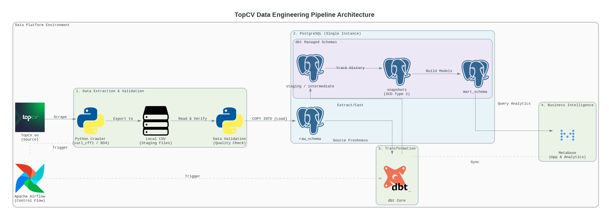
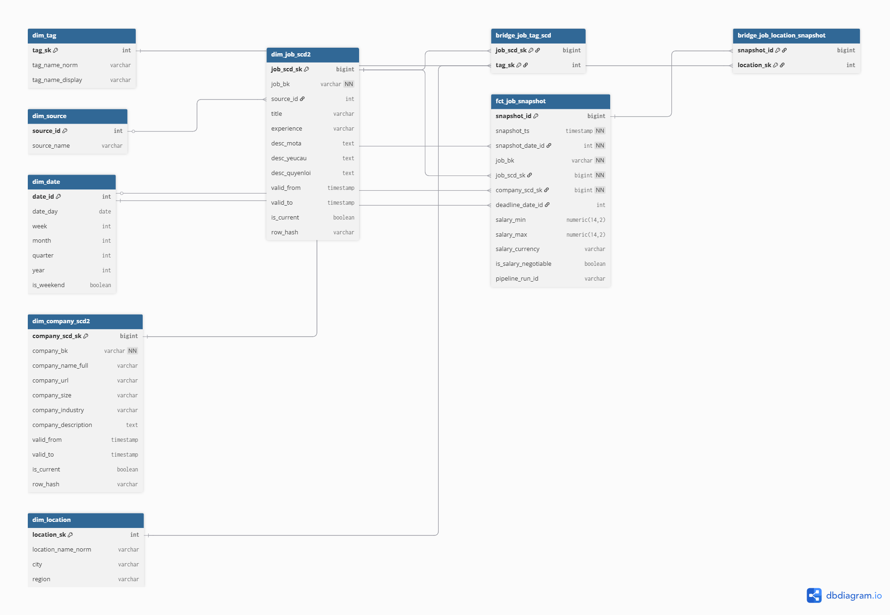
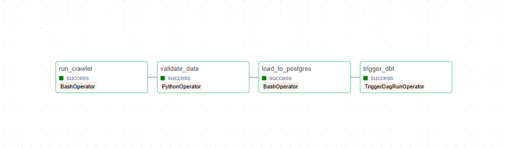
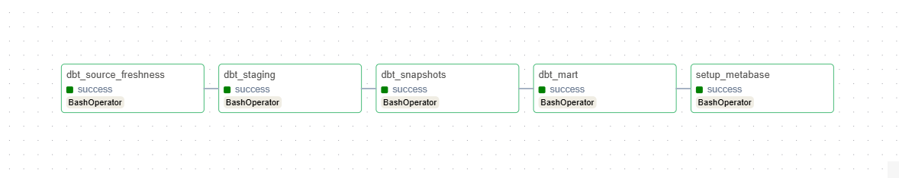
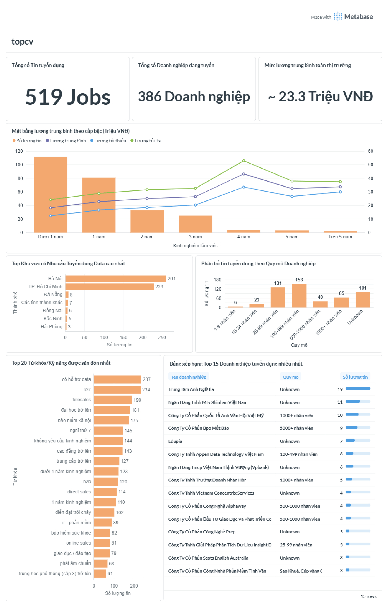

# TopCV Data Pipeline

An ELT pipeline for collecting, processing, and analyzing recruitment data from TopCV using Python + PostgreSQL + dbt + Airflow + Metabase.

---

## 1) Project Objectives

* Crawl job postings from TopCV by page.
* Store raw data in a `raw` table in PostgreSQL.
* Transform data through staging → intermediate → marts layers using dbt.
* Track dimension changes using dbt snapshots (SCD Type 2).
* Sync metadata to Metabase for BI dashboards.

---

## 2) Technology Stack

* **Python**: curl_cffi, BeautifulSoup4, pandas, psycopg2
* **PostgreSQL 15**
* **dbt Core** (dbt-postgres 1.7.9)
* **Apache Airflow 2.8.1** (LocalExecutor)
* **Metabase**
* **Docker Compose**

---

## 3) Overall Architecture

The project follows an ELT architecture with 4 main layers:

1. **Data Ingestion Layer**
   A crawler collects job postings from TopCV, standardizes basic fields, and outputs daily raw CSV files.

2. **Data Storage Layer**
   A loader ingests raw data into the PostgreSQL `raw` schema, serving as the source for dbt.

3. **Transformation Layer**
   dbt processes data through staging → intermediate → marts layers, while maintaining historical snapshots.

4. **Serving / BI Layer**
   Metabase connects to the marts schema for KPI visualization and analytical dashboards.

### Workflow Overview

* Airflow orchestrates crawl and load jobs.
* Once raw data is ready, dbt runs models and data quality tests.
* Modeled data is exposed to Metabase for analytics.

### Architecture Diagram



### Data Modeling Architecture



The data model follows **Dimensional Modeling (Kimball-style Star Schema):**

* **Central fact table**: `fct_job_snapshot` (job metrics at each snapshot point)
* **Dimensions**:
  `dim_job`, `dim_company`, `dim_date`, `dim_location`, `dim_source`, `dim_tag`
* **Bridge table**:
  `bridge_job_tags` (many-to-many relationship between jobs and tags/skills)

### Layered Modeling Structure

1. **Staging**: standardize column names, data types, and business keys
2. **Intermediate**: clean and separate core entities (job, company, location, tags)
3. **Snapshots**: track dimension history using SCD Type 2
4. **Marts**: build fact and dimension tables for BI queries

---

## 4) Airflow DAGs

### `topcv_crawler_dag`

File: `dags/topcv_crawler_dag.py`



* Handles crawling, validating raw data, and loading into PostgreSQL
* Triggers the dbt DAG upon completion

---

### `topcv_dbt_dag`

File: `dags/topcv_dbt_dag.py`



* Runs dbt steps: freshness, models, snapshots, tests
* Syncs metadata to Metabase
* Triggered by the crawler DAG to ensure raw data readiness

---

## 5) Project Structure

```bash
topcv-data-pipeline/
|-- .env                                # Runtime environment variables (local)
|-- .env.example                        # Environment template
|-- .gitignore                          # Git ignore config
|-- docker-compose.yml                  # Service definitions (Postgres, Airflow, Metabase)
|-- Dockerfile                          # Python image for ETL tasks
|-- Dockerfile.airflow                  # Airflow + dbt image
|-- init.sql                            # Initial DB/schema setup
|-- LICENSE                             # Project license
|-- README.md                           # Documentation
|-- requirements.txt                    # Python dependencies
|
|-- dags/
|   |-- topcv_crawler_dag.py
|   |-- topcv_dbt_dag.py
|
|-- data/
|   |-- raw/
|       |-- topcv_jobs_YYYYMMDD.csv     # daily raw data
|
|-- dbt_transform/
|   |-- dbt_project.yml
|   |-- profiles.yml
|   |-- macros/
|   |-- models/
|   |-- snapshots/
|
|-- metabase/
|   |-- sql/
|       |-- 01_top_recruitment_keywords.sql
|       |-- 02_salary_benchmark_by_experience.sql
|       |-- 03_hotspots_by_location.sql
|       |-- 04_company_size_distribution.sql
|       |-- 05_top_hiring_companies_leaderboard.sql
|       |-- 06_hiring_trend_over_time.sql|   
|
|-- src/
|   |-- extract/
|       |-- scraper.py
|   |-- load/
|       |-- load_data_to_postgres.py
|   |-- metabase/
|       |-- setup_metabase.py
|

```


---

## 6) Quick Start with Docker

### Step 1: Prepare Environment Variables

```bash
cp .env.example .env
```

Update important values in `.env`:

* `DB_PASSWORD`
* `POSTGRES_PASSWORD`
* `AIRFLOW_WEBSERVER_SECRET_KEY`
* `AIRFLOW_ADMIN_PASSWORD`
* `METABASE_ADMIN_PASSWORD`
* Scraper configs:
  `SCRAPER_MAX_PAGES`, `SCRAPER_PAGE_DELAY_MIN`, `SCRAPER_PAGE_DELAY_MAX`

---

### Step 2: Start Services

```bash
docker-compose up -d
```

Check containers:

```bash
docker-compose ps
```

---

### Step 3: Access Services

* Airflow UI: [http://localhost:8080](http://localhost:8080)
* Metabase: [http://localhost:3000](http://localhost:3000)
* PostgreSQL: `localhost:${POSTGRES_EXPOSE_PORT}`

---

### Step 4: Run the Pipeline

Only supported method: **Docker + Airflow**

1. Open Airflow UI
2. Enable `topcv_crawler_dag`
3. Trigger the DAG
4. Monitor tasks in Graph View
5. After completion, `topcv_dbt_dag` runs automatically
6. Check results in Metabase

---

## 7) Sample BI Queries

Located in `metabase/sql`:



* Top recruitment keywords
* Salary benchmark by experience
* Hiring hotspots by location
* Company size distribution
* Top hiring companies leaderboard
* Hiring trend over time

---
## 8) License
- MIT License

